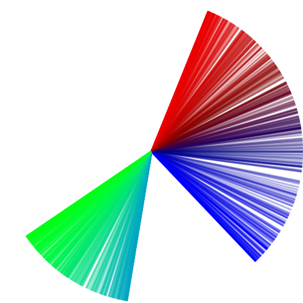

Trabalho 1

O programa se baseia em uma única função principal, a função do mapa logístico. A função foi inventada em 1976 pelo biólogo Robert May, e ela tinha como objetivo capturar dois efeitos em populações: reprodução e fome.

A função recebe dois parâmetros: a população inicial e a taxa de reprodução. A população inicial é expressa em % do máximo que ela possa ser, ou seja, um valor real entre 0 e 1.
Ja o R pode assumir qualquer valor real, no entanto, alguns determinados valores apresentam comportamentos mais interessantes. Alguns highlights são: 2.8, 3.2, 3.5, 3.55. Com esses valores, é possível observar o fenômeno chamado de *period doubling*, onde os valores de estabilização de X oscilam entre mais de 1 valor, e duplicam depois de um certo *r*. Cuidado com R = 3.6 !!!

Para usar o programa basta chamar a funcao main e informar os valores requisitados.

 
  

